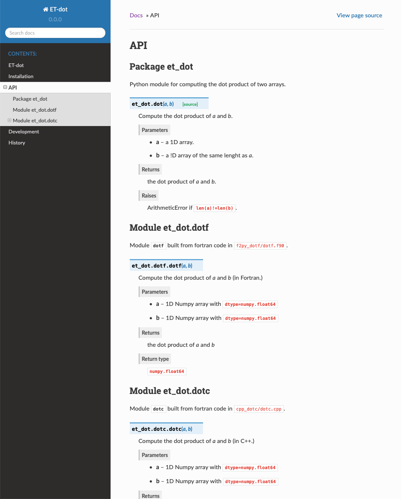

.. _micc-build: https://github.com/etijskens/et-micc-build

.. _tutorial-2:

Tutorial 2: Binary extensions
=============================

.. _intro-HPPython:

2.1 Introduction - High Performance Python
------------------------------------------
Suppose for a moment that Numpy_ did not have a dot product implementation and that
the implementation provided in Tutorial-1 is way too slow to be practical for your
research project. Consequently, you are forced to accelarate your dot product code
in some way or another. There are several approaches for this. Here are a number of
highly recommended links covering them:

* `Why you should use Python for scientific research <https://developer.ibm.com/dwblog/2018/use-python-for-scientific-research/>`_
* `Performance Python: Seven Strategies for Optimizing Your Numerical Code <https://www.youtube.com/watch?v=zQeYx87mfyw>`_
* `High performance Python 1 <http://www.admin-magazine.com/HPC/Articles/High-Performance-Python-1>`_
* `High performance Python 2 <http://www.admin-magazine.com/HPC/Articles/High-Performance-Python-2>`_
* `High performance Python 3 <http://www.admin-magazine.com/HPC/Articles/High-Performance-Python-3>`_
* `High performance Python 4 <http://www.admin-magazine.com/HPC/Articles/High-Performance-Python-4>`_

Two of the approaches discussed in the *High Performance Python* series involve rewriting
your code in Modern Fortran or C++ and generate a shared library that can be imported in
Python just as any Python module. This is exactly the approach taken in important HPC
Python modules, such as Numpy_, pyTorch_ and pandas_.
Such shared libraries are called *binary extension modules*. Constructing binary extension
modules is by far the most scalable and flexible of all current acceleration strategies, as
these languages are designed to squeeze the maximum of performance out of a CPU.

However, figuring out how to build such binary extension modules is a bit of a challenge,
especially in the case of C++. This is in fact one of the main reasons why Micc_ was designed:
facilitating the construction of binary extension modules and enabling the developer to create
high performance tools with ease.
To that end, Micc_ provides boilerplate code for binary extensions as well a practical wrapper
around top-notch tools for building the binary extensions from Fortran and C++ source. This
wrapper is called micc-build_. It uses CMake_ to pass the necessary parameters to the compiler.
In between the compiler and CMake_ there is a tool that tells how a Python module is to be
constructed from the source code. For Fortran that is f2py_ (which comes with Numpy_), and
for C++ it is pybind11_. This is illustrated in the figure below:

   .. image:: ../tutorials/im-building.png

There is a difference in how f2py_ and pybind11_ operate. F2py_ is an *executable* that inspects
the Fortran source and create wrappers for the subprograms it finds and uses the compiler to
build the extension module. (The wrappers are in C, so f2py_ needs a C compiler as well).
Pybind11_ is a *C++ template library* that is used to express what needs to be exposed in the
binary extension module.

.. _f90-orr-cpp:

2.1.1 Choosing between Fortran and C++ for binary extension modules [intermediate]
^^^^^^^^^^^^^^^^^^^^^^^^^^^^^^^^^^^^^^^^^^^^^^^^^^^^^^^^^^^^^^^^^^^^^^^^^^^^^^^^^^
    Here are a number of arguments that you may wish to take into account for choosing the
    programming language for your binary extension modules:

    * Fortran is a simpler language than C++.
    * It is easier to write efficient code in Fortran than C++.
    * C++ is a general purpose language (as is Python), whereas Fortran is meant for scientific
      computing. Consequently, C++ is a much more expressive language.
    * C++ comes with a huge standard library, providing lots of data structures and algorithms
      that are hard to match in Fortran. If the standard library is not enough, there are also
      the highly recommended `Boost <https://boost.org>`_ libraries and many other high
      qualityh domain specific libraries. There are also domain specific libraries in Fortran,
      but their count differs by an order of magnitude at least.
    * With Pybind11_ you can almost expose anything from the C++ side to Python, not just
      functions.
    * Modern Fortran is (imho) not as good documented as C++. Useful place to look for
      language features and idioms are:

      * https://www.fortran90.org/
      * http://www.cplusplus.com/
      * https://en.cppreference.com/w/

    In short, C++ provides much more possibilities, but it is not for the novice.
    As to my own experience, I discovered that working on projects of moderate complexity
    I progressed significantly faster using Fortran rather than C++, despite the fact that
    my knowledge of Fortran is quite limited compared to C++. However, your mileage may vary.

.. _add-bin-ext:

2.2 Adding Binary extensions to a Micc_ project
-----------------------------------------------

Adding a binary extension to your current project is as simple as::

    > micc add foo --f90   # add a binary extension 'foo' written in (Modern) Fortran
    ...
    > micc add bar --cpp   # add a binary extension 'bar' written in C++
    ...

You can add as many binary extensions to your code as you want. However, the project
must have a *package* structure (see :ref:`modules-and-packages` for how to convert
a project with a *module* structure). Micc_ puts the source files for the foo Fortran
binary extension in subdirectory :file:`f90_foo` of the package directory, and for the
C++ binary extension in subdirectory :file:`cpp_bar` of the package directory.

Enter your own code in the generated source code files. The output of the ``micc add``
commands will have a line like::

    [INFO]               - Fortran source in       <my_project>/<my_package>/f90_foo/foo.f90.

or::

    [INFO]               - C++ source in       <my_project>/<my_package>/cpp_bar/bar.cpp.

where ``<my_project>`` is the project directory and ``<my_package>`` is the package directory.

This tells you where to add your code. After entering yor code, activate your project's virtual
environment, and run ``micc-build``::

   > source .venv/bin/activate
   (.venv) > micc-build
   ...                      # a lot of output

If there are no syntax errors all your binary extensions will be built, and you
will be able to import the  modules :py:mod:`foo` and :py:mod:`bar` in your
project and use their subroutines and functions. Because :py:mod:`foo` and
:py:mod:`bar` are submodules of your micc_ project, you must import them as::

    import my_package.foo
    import my_package.bar

    # call foofun in my_package.foo
    my_package.foo.foofun(...)

    # call barfun in my_package.bar
    my_package.bar.barfun(...)

Now that the general principles are laid out, we can go into the details.

.. _micc-build-options:

2.2.3 micc-build options
^^^^^^^^^^^^^^^^^^^^^^^^

Here is an overview of micc-build options. The most interesting options are:

    * ``-m <module-to-build>``: build only the specified module, as opposed to
      all binary extension modules in the project
    * ``-b <build-type>``: build a ``<build-type>`` version, default=``RELEASE``,
      otherwise ``DEBUG``, MINSIZEREL, ``RELWITHDEBINFO``.
    * ``--clean``: perform a clean build

.. code-block:: bash

    > micc-build --help
    Usage: micc-build [OPTIONS]

      Build binary extension libraries (f90 and cpp modules).

    Options:
      -v, --verbosity          The verbosity of the program.
      -p, --project-path PATH  The path to the project directory. The default is
                               the current working directory.

      -m, --module TEXT        Build only this module. The module kind prefix
                               (``cpp_`` for C++ modules, ``f90_`` for Fortran
                               modules) may be omitted.

      -b, --build-type TEXT    build type: any of the standard CMake build types:
                               DEBUG, MINSIZEREL, RELEASE, RELWITHDEBINFO.

      --clean                  Perform a clean build.
      --cleanup                Cleanup build directory after successful build.
      --version                Show the version and exit.
      --help                   Show this message and exit.

.. _building-f90:

2.3 Building binary extensions from Fortran
-------------------------------------------
Let us add a binary extension module for a dot product version written in Fortran.
First, we verify that our ``ET-dot`` project has a package structure (assuming that
the current working directory is the project directory :file:`ET-dot`)::

    > micc info
    Project ET-dot located at /home/bert/software/workspace/ET-dot
      package: et_dot
      version: 0.0.0
      structure: et_dot/__init__.py (Python package)
    >

If the last line reads::

   ...
     structure: et_dot.py (Python module)

you must convert the project::

     > micc convert-to-package --overwrite
     ...

(See :ref:`modules-and-packages` for details).

We are now ready to create a f90 module for a Fortran implementation of the
dot product, say ``dotf``, where the ``f``, obviously, is for Fortran::

    > micc add dotf --f90
    [INFO]           [ Adding f90 module dotf to project ET-dot.
    [INFO]               - Fortran source in       ET-dot/et_dot/f90_dotf/dotf.f90.
    [INFO]               - Build settings in       ET-dot/et_dot/f90_dotf/CMakeLists.txt.
    [INFO]               - Python test code in     ET-dot/tests/test_f90_dotf.py.
    [INFO]               - module documentation in ET-dot/et_dot/f90_dotf/dotf.rst (in restructuredText format).
    [WARNING]            Dependencies added. Run \'poetry update\' to update the project\'s virtual environment.
    [INFO]           ] done.

The output tells us where to enter the Fortran source code, the test code and the documentation.
These files contain already working example code.

The warning in the output above tells us that micc_ added some development dependencies
to our project. These dependencies provide the machinery to build binary extension
modules and must be installed in the virtual environment of our project. The easy
way to do this is by running ``poetry install`` as is mentioned in the warning.
The former will install missing dependencies, the latter will get the latest
version of all dependencies and install them.

.. code-block:: bash

    > poetry install
    Updating dependencies
    Resolving dependencies... (15.1s)

    Writing lock file

    Package operations: 18 installs, 1 update, 0 removals

      • Installing python-dateutil (2.8.1)
      • Installing arrow (0.17.0)
      • Installing soupsieve (2.1)
      • Installing text-unidecode (1.3)
      • Installing beautifulsoup4 (4.9.3)
      • Installing binaryornot (0.4.4)
      • Installing jinja2-time (0.2.0)
      • Installing poyo (0.5.0)
      • Installing python-slugify (4.0.1)
      • Installing cookiecutter (1.7.2)
      • Installing pypi-simple (0.8.0)
      • Installing semantic-version (2.8.5)
      • Updating sphinx-rtd-theme (0.5.1 -> 0.4.3)
      • Installing tomlkit (0.5.11)
      • Installing walkdir (0.4.1)
      • Installing et-micc (1.0.12)
      • Installing numpy (1.19.5)
      • Installing pybind11 (2.6.1)
      • Installing et-micc-build (1.0.12)

    Installing the current project: ET-dot (0.0.6)

In fact the only dependency added in :file:`pyproject.toml` was micc-build_,
but that depends on numpy, pybind11 and et-micc, which in turn have their own
sub-dependencies, all of which are nicely resolved by poetry_ and installed.
Although micc-build_ also needs CMake_, it is not added as dependency of micc-build_>
In view of the widespread use of CMake_, it was considered better have a system-wide
CMake installation (see section :ref:`development-environment`).

The dependency of :file:`et-micc-build` on :file:`et-micc` makes that ``micc`` is now
also installed in the project's virtual environment. Therefore, when the project's
virtual environment is activated, the active ``micc`` is the one in the project's
virtual environment, which might be a more recent version than the system-wide micc::

    > source .venv/bin/activate
    (.venv) > which micc
    path/to/ET-dot/.venv/bin/micc
    (.venv) >

If you do not want to use poetry_ to install the dependencies, you can lookup the
dependencies in :file:`pyproject.toml`, see that there is only ``et-micc-build``,
and run ``pip install et-micc-build`` in the Python environment you want to use
for your project development. (Using a virtual environment is good practise, see
:ref:`virtual-environments`).

Let's continue our development of a Fortran version of the dot product. Replace the
existing code in the Fortran source file :file:`ET-dot/et_dot/f90_dotf/dotf.f90`
(using your favourite editor or an IDE) with:

.. code-block:: fortran

   function dotf(a,b,n)
     ! Compute the dot product of a and b
     !
       implicit none
     !-------------------------------------------------------------------------------------------------
       integer*4              , intent(in)    :: n
       real*8   , dimension(n), intent(in)    :: a,b
       real*8                                 :: dotf
     !-------------------------------------------------------------------------------------------------
     ! declare local variables
       integer*4 :: i
     !-------------------------------------------------------------------------------------------------
       dotf = 0.
       do i=1,n
           dotf = dotf + a(i) * b(i)
       end do
   end function dotf

The binary extension module can now be built by running ``micc-build``. This produces
a lot of output, most of which is omitted here, except for the build settings discovered
by CMake_::

    [INFO] [ Building f90 module 'dotf':
    [INFO]           --clean: shutil.removing('/Users/etijskens/software/dev/workspace/ET-dot/et_dot/f90_dotf/_cmake_build').
    [DEBUG]          [ > cmake -D PYTHON_EXECUTABLE=/Users/etijskens/software/dev/workspace/ET-dot/.venv/bin/python -D CMAKE_BUILD_TYPE=RELEASE ..    ...
    ...
                       # Build settings ###################################################################################
                       CMAKE_Fortran_COMPILER: /usr/local/bin/gfortran
                       CMAKE_BUILD_TYPE      : RELEASE
                       F2PY_opt              : --opt='-O3'
                       F2PY_arch             :
                       F2PY_f90flags         :
                       F2PY_debug            :
                       F2PY_defines          : -DNPY_NO_DEPRECATED_API=NPY_1_7_API_VERSION;-DF2PY_REPORT_ON_ARRAY_COPY=1;-DNDEBUG
                       F2PY_includes         :
                       F2PY_linkdirs         :
                       F2PY_linklibs         :
                       module name           : dotf.cpython-38-darwin.so
                       module filepath       : /Users/etijskens/software/dev/workspace/ET-dot/et_dot/f90_dotf/_cmake_build/dotf.cpython-38-darwin.so
                       source                : /Users/etijskens/software/dev/workspace/ET-dot/et_dot/f90_dotf/dotf.f90
                       python executable     : /Users/etijskens/software/dev/workspace/ET-dot/.venv/bin/python [version=Python 3.8.5]
                         f2py executable     : /Users/etijskens/software/dev/workspace/ET-dot/.venv/bin/f2py [version=2]
                       ####################################################################################################
    ...

    [INFO] ] done.
    [INFO]           Binary extensions built successfully:
    [INFO]           - /Users/etijskens/software/dev/workspace/ET-dot/et_dot/dotf.cpython-38-darwin.so
    (.venv) >

At the end of the output is a summary of all binary extensions that have been built, or
failed to build. If the source file does not have any syntax errors, you will see a file like
:file:`dotf.cpython-38-darwin.so` in directory :file:`ET-dot/et_dot`, Its extension depends on
the Python version (c.q. 3.8) you are using, and on your operating system (c.q. MacOS).

.. code-block:: bash

    (.venv) > ls -l et_dot
    total 8
    -rw-r--r--  1 etijskens  staff  720 Dec 13 11:04 __init__.py
    drwxr-xr-x  6 etijskens  staff  192 Dec 13 11:12 f90_dotf/
    lrwxr-xr-x  1 etijskens  staff   92 Dec 13 11:12 dotf.cpython-38-darwin.so

This file is the binary extension module, which can be imported like any other Python module.

Since our binary extension is built, we can test it. Here is some test code. Enter it in file
:file:`ET-dot/tests/test_f90_dotf.py`:

.. code-block:: python

    import numpy as np
    # import the binary extension and rename the module locally as f90
    import et_dot
    #create alias to dotf binary extension module
    f90 = et_dot.dotf

    def test_dotf_aa():
        a = np.array([0,1,2,3,4],dtype=np.float)
        expected = np.dot(a,a)
        # call the dotf function in the binary extension module:
        a_dotf_a = f90.dotf(a,a)
        assert a_dotf_a==expected

The astute reader will notice the magic that is happening here: *a* is a numpy array,
which is passed as is to our :py:meth:`et_dot.dotf.dotf` function in our binary extension.
An invisible wrapper function will check the types of the numpy arrays, retrieve pointers
to the memory of the numpy arrays, as well as the length of the arrays, and feed these
into our Fortran function, which computes the dot product. Next, the wrapper creates a
Python object and stores the outcome of computation in it, which is finally assigened to
the Python variable :py:obj:`a_dotf_a. If you look carefully at the output of ``micc-build``,
you will see information about the wrappers that ``f2py`` constructed. These wrappers are
generated by f2py_ in C code, and thus it needs a C compiler, in addition to the Fortran
compiler for compilin our :file:`dotf.f90`.

Passing Numpy arrays directly to Fortran routines is *extremely productive*.
Many useful Python packages use numpy_ for arrays, vectors, matrices, linear algebra, etc.
Being able to pass Numpy arrays directly into your own number crunching routines
relieves you from conversion between array types. In addition you can do the memory
management of your arrays and their initialization most conveniently in Python.

As you can see we test the outcome of dotf against the outcome of :py:meth:`numpy.dot`.
We thrust that outcome, but beware that this test may be susceptible to round-off error
because the representation of floating point numbers in Numpy and in Fortran may differ
slightly.

Here is the outcome of ``pytest``:

.. code-block:: bash

   > pytest
   ================================ test session starts =================================
   platform darwin -- Python 3.7.4, pytest-4.6.5, py-1.8.0, pluggy-0.13.0
   rootdir: /Users/etijskens/software/dev/workspace/ET-dot
   collected 8 items

   tests/test_et_dot.py .......                                                   [ 87%]
   tests/test_f90_dotf.py .                                                       [100%]

   ============================== 8 passed in 0.16 seconds ==============================
   >

All our tests passed. Of course we can extend the tests in the same way as we did for the
naive Python implementation in the previous tutorial. We leave that as an exercise to the
reader.

The way in which we accessed the binary extension module in the test code:

.. code-block:: python

    import et_dot
    #create alias to dotf binary extension module
    f90 = et_dot.dotf

is only possible because micc_ has taken care for us that the file :file:`et_dot/__init__.py`
imports the binary extension module :file:`dotf`:

.. code-block:: python

    import et_dot.dotf

In fact, micc_ added a little magic to automatically build the binary extension module
if it cannot be found.

.. _f90-modules:

2.3.1 Fortran modules [intermediate]
^^^^^^^^^^^^^^^^^^^^^^^^^^^^^^^^^^^^
    This may be a bit confusing, as we have been talking about Python modules, so far.
    Fortran also has *modules*, to group things that belong together. So, these modules
    are something different than the binary extension modules written in Fortran, which
    are in fact Python modules.
    If you put your subroutines and functions inside a Fortran module, that is in a
    ``MODULE/END MODULE`` block, as in:

    .. code-block:: fortran

        MODULE my_f90_module
        implicit none
        contains
          function dot(a,b)
            ...
          end function dot
        END MODULE my_f90_module

    then f2py will expose the Fortran module name :py:obj:`my_f90_module`
    which in turn contains the function/subroutine names:

    .. code-block:: Python

        >>> import et_dot
        >>> a = [1.,2.,3.]
        >>> b = [2.,2.,2.]
        >>> et_dot.dot(a,b) # this is the python version of the dot product
        12
        >>> et_dot.dotf.my_F90_module.dotf(a,b)
        created an array from object
        created an array from object
        12.0

    Note, the ``created an array from object`` warnings that appear when calling the
    Fortran version of the dot product :py:obj:`dotf`. As :py:obj:`a` and :py:obj:`b` are
    Python lists and not numpy arrays, the wrapper of ``dotf`` that was created by f2py_
    has performed a conversion. Though this is sometimes practical, it comes at a cost:
    a numpy array has to be created and the data in the :py:obj:`lists` are copied to
    the numpy array which is passed to the Fortran function. When the computation is
    done the numpy arrays are destroyed. Micc_ instructs f2py_ to issue warnings when
    potentially expensensive copy operations are performed by specifying the
    ``F2PY_REPORT_ON_ARRAY_COPY=1`` flag (see the build settings in the output of the
    ``micc-build`` command.

    If you are bothered by having to type ``et_dot.dotf.my_f90_module.`` every time,
    use this Python trick, which creates an alias for the Fortran object
    ``et_dot.dotf.my_f90_module``:

    .. code-block:: Python

        >>> import et_dot
        >>> f90 = et_dot.dotf.my_f90_module
        >>> f90.dotf(a,b)
        12.0

    You can eve create an alias for the :py:obj:`dotf` function itself:

    .. code-block:: Python

        >>> import et_dot
        >>> dotf = et_dot.dotf.my_f90_module.dotf
        >>> dotf(a,b)
        12.0

.. _control-build-f90:

2.3.2 Controlling the build [intermediate]
^^^^^^^^^^^^^^^^^^^^^^^^^^^^^^^^^^^^^^^^^^

    The build parameters for our Fortran binary extension module are detailed in
    the file :file:`et_dot/f90_dotf/CMakeLists.txt`. It is a rather lengthy file,
    but most of it is boilerplate code which you should not need to touch. The
    boilerplate sections are clearly marked. By default this file specifies that
    a release version is to be built. The file documents a set of CMake variables
    that can be used to control the build type:

    * CMAKE_BUILD_TYPE : DEBUG | MINSIZEREL | RELEASE* | RELWITHDEBINFO
    * F2PY_noopt : turn off optimization options
    * F2PY_noarch : turn off architecture specific optimization options
    * F2PY_f90flags : additional compiler options
    * F2PY_arch : architecture specific optimization options
    * F2PY_opt : optimization options

    In addition you can specify

    * preprocessor macro definitions
    * include directories
    * link directories
    * link libraries

    Here are the sections of :file:`CMakeLists.txt` to control the build. Uncomment
    the parts you need and modify them to your needs.

    .. code-block:: cmake

        ...
        # Set the build type:
        #  - If you do not specify a build type, it is RELEASE by default.
        #  - Note that the DEBUG build type will trigger f2py's '--noopt --noarch --debug' options.
        # set(CMAKE_BUILD_TYPE DEBUG | MINSIZEREL | RELEASE | RELWITHDEBINFO)

        #<< begin boilerplate code
            ...
        #>> end boilerplate code

        ##################################################################################
        ####################################################### Customization section ####
        # Specify compiler options #######################################################
        # Uncomment to turn off optimization:
        # set(F2PY_noopt 1)

        # Uncomment to turn off architecture specific optimization:
        # set(F2PY_noarch 1)

        # Set additional f90 compiler flags:
        # set(F2PY_f90flags your_flags_here)

        # Set architecture specific optimization compiler flags:
        # set(F2PY_arch your_flags_here)

        # Overwrite optimization flags
        # set(F2PY_opt your_flags_here)

        # Add preprocessor macro definitions ###############################################################
        # add_compile_definitions(
        #     OPENFOAM=1912                     # set value
        #     WM_LABEL_SIZE=$ENV{WM_LABEL_SIZE} # set value from environment variable
        #     WM_DP                             # just define the macro
        # )

        # Add include directories ##########################################################################
        # include_directories(
        #     path/to/dir1
        #     path/to/dir2
        # )

        # Add link directories #############################################################################
        # link_directories(
        #     path/to/dir1
        # )

        # Add link libraries (lib1 -> liblib1.so) ##########################################################
        # link_libraries(
        #     lib1
        #     lib2
        # )
        ####################################################################################################

        # only boilerplate code below
        ...

.. _building-cpp:

2.4 Building binary extensions from C++
---------------------------------------
To illustrate building binary extension modules from C++ code, let us also create a
C++ implementation for the dot product. Such modules are called *cpp modules*.
Analogously to our :py:mod:`dotf` module we will call the cpp module :py:mod:`dotc`,
the ``c`` referring to C++.

Use the ``micc add`` command to add a cpp module:

.. code-block:: bash

    > micc add dotc --cpp
    [INFO]           [ Adding cpp module dotc to project ET-dot.
    [INFO]               - C++ source in           ET-dot/et_dot/cpp_dotc/dotc.cpp.
    [INFO]               - build settings in       ET-dot/et_dot/cpp_dotc/CMakeLists.txt.
    [INFO]               - module documentation in ET-dot/et_dot/cpp_dotc/dotc.rst (in restructuredText format).
    [INFO]               - Python test code in     ET-dot/tests/test_cpp_dotc.py.
    [INFO]           ] done.

The output explains you where to add the C++ source code, the test code and the
documentation.  Note that this time there is no warning about dependencies being
added, because we took already care of that when we added the Fortran module
:py:mod:`dotf` above (see :ref:`building-f90`).

Micc_ uses pybind11_ to create wrappers for C++ functions. This
is by far the most practical choice for this (see
https://channel9.msdn.com/Events/CPP/CppCon-2016/CppCon-2016-Introduction-to-C-python-extensions-and-embedding-Python-in-C-Apps
for a good overview of this topic). It has a lot of 'automagical' features, and
it is a header-only C++ library.
`Boost.Python <https://www.boost.org/doc/libs/1_70_0/libs/python/doc/html/index.html>`_
offers very similar features, but is not header-only and its library depends on
the python version you want to use - so you need a build a  different library for every
Python version you want to use.

Enter this code in the C++ source file :file:`ET-dot/et_dot/cpp_dotc/dotc.cpp`

.. code-block:: c++

   #include <pybind11/pybind11.h>
   #include <pybind11/numpy.h>

   double
   dotc( pybind11::array_t<double> a
       , pybind11::array_t<double> b
       )
   {
       auto bufa = a.request()
          , bufb = b.request()
          ;
    // verify dimensions and shape:
       if( bufa.ndim != 1 || bufb.ndim != 1 ) {
           throw std::runtime_error("Number of dimensions must be one");
       }
       if( (bufa.shape[0] != bufb.shape[0]) ) {
           throw std::runtime_error("Input shapes must match");
       }
    // provide access to raw memory
    // because the Numpy arrays are mutable by default, py::array_t is mutable too.
    // Below we declare the raw C++ arrays for x and y as const to make their intent clear.
       double const *ptra = static_cast<double const *>(bufa.ptr);
       double const *ptrb = static_cast<double const *>(bufb.ptr);

       double d = 0.0;
       for (size_t i = 0; i < bufa.shape[0]; i++)
           d += ptra[i] * ptrb[i];

       return d;
   }

   // describe what goes in the module
   PYBIND11_MODULE(dotc, m) // m is variable, holding the module description
                            // dotc is the module's name
   {// optional module docstring:
       m.doc() = "pybind11 dotc plugin";
    // list the functions you want to expose:
    // m.def("exposed_name", function_pointer, "doc-string for the exposed function");
       m.def("dotc", &dotc, "The dot product of two arrays 'a' and 'b'.");
   }

Obviously the C++ source code is more involved than its Fortran equivalent in the
previous section. This is because f2py_ is a program performing clever introspection
into the Fortran source code, whereas pybind11_ is "nothing" but a C++ template library.
As such it is not capable of introspection and the user is obliged to use
pybind11_ for accessing the arguments passed in by Python. At the cost of being more
verbose, it is more flexible.

We can now build the module. Because we do not want to rebuild the :py:mod:`dotf` module
we add ``-m dotc`` to the command line, to indicate that only module :py:mod:`dotc` must
be built::

    (.venv) > micc build -m dotc
    [INFO] [ Building cpp module 'dotc':
    [DEBUG]          [ > cmake -D PYTHON_EXECUTABLE=/Users/etijskens/software/dev/workspace/ET-dot/.venv/bin/python -D pybind11_DIR=/Users/etijskens/software/dev/workspace/ET-dot/.venv/lib/python3.8/site-packages/pybind11/share/cmake/pybind11 -D CMAKE_BUILD_TYPE=RELEASE ..
    [DEBUG]              (stdout)
                           -- Found pybind11: /Users/etijskens/software/dev/workspace/ET-dot/.venv/lib/python3.8/site-packages/pybind11/include (found version "2.6.1" )
                           -- Configuring done
                           -- Generating done
                           -- Build files have been written to: /Users/etijskens/software/dev/workspace/ET-dot/et_dot/cpp_dotc/_cmake_build
    [DEBUG]              (stderr)
                           pybind11_DIR : /Users/etijskens/software/dev/workspace/ET-dot/.venv/lib/python3.8/site-packages/pybind11/share/cmake/pybind11
    [DEBUG]          ] done.
    [DEBUG]          [ > make
    [DEBUG]              (stdout)
                           Scanning dependencies of target dotc
                           [ 50%] Building CXX object CMakeFiles/dotc.dir/dotc.cpp.o
                           [100%] Linking CXX shared module dotc.cpython-38-darwin.so
                           [100%] Built target dotc
    [DEBUG]          ] done.
    [DEBUG]          [ > make install
    [DEBUG]              (stdout)
                           [100%] Built target dotc
                           Install the project...
                           -- Install configuration: "RELEASE"
                           -- Installing: /Users/etijskens/software/dev/workspace/ET-dot/et_dot/cpp_dotc/../dotc.cpython-38-darwin.so
    [DEBUG]          ] done.
    [INFO] ] done.
    [INFO]           Binary extensions built successfully:
    [INFO]           - /Users/etijskens/software/dev/workspace/ET-dot/et_dot/dotc.cpython-38-darwin.so
    (.venv) >

The output shows that first ``CMake`` is called, followed by ``make`` and the installation
of the binary extension with a soft link. Finally, lists of modules that have been built
successfully, and modules that failed to build are output.

As for the Fortran case, the ``micc-build`` command produces a lot of output, most of
which is rather uninteresting - except in the case of errors. If the source file does
not have any syntax errors, and the build did not experience any problems, you will
also see a file like :file:`dotc.cpython-38-darwin.so` in directory :file:`ET-dot/et_dot`,
which is the binary extension module that we can import in Python::

    (.venv) > ls -l et_dot
    total 8
    -rw-r--r--  1 etijskens  staff  1339 Dec 13 14:40 __init__.py
    drwxr-xr-x  4 etijskens  staff   128 Dec 13 14:29 __pycache__/
    drwxr-xr-x  7 etijskens  staff   224 Dec 13 14:43 cpp_dotc/
    lrwxr-xr-x  1 etijskens  staff    93 Dec 13 14:43 dotc.cpython-38-darwin.so
    lrwxr-xr-x  1 etijskens  staff    94 Dec 13 14:27 dotf.cpython-38-darwin.so
    drwxr-xr-x  6 etijskens  staff   192 Dec 13 14:43 f90_dotf/
    (.venv) >

.. note:: The extension of the module :file:`dotc.cpython-38-darwin.so`
   will depend on the Python version you are using, and on the operating system.

Here is the test code. It is almost exactly the same as that for the f90 module :py:mod:`dotf`,
except for the module name. Enter the test code in :file:`ET-dot/tests/test_cpp_dotc.py`:

.. code-block:: python

   import numpy as np
   import et_dot
   # create alias to dotc binary extension module:
   cpp = et_dot.dotc

   def test_dotc_aa():
       a = np.array([0,1,2,3,4],dtype=np.float)
       expected = np.dot(a,a)
       # call function dotc in the binary extension module:
       a_dotc_a = cpp.dotc(a,a)
       assert a_dotc_a==expected

The conversion between the Numpy arrays to C++ arrays is here less magical, as the user
must provide code to do the conversion of Python variables to C++. This has the advantage
of showing the mechanics of the conversion more clearly, but it also leaves more space for
mistakes, and to beginners it may seem more complicated.

Finally, run pytest:

.. code-block:: bash

   > pytest
   ================================ test session starts =================================
   platform darwin -- Python 3.7.4, pytest-4.6.5, py-1.8.0, pluggy-0.13.0
   rootdir: /Users/etijskens/software/dev/workspace/ET-dot
   collected 9 items

   tests/test_cpp_dotc.py .                                                       [ 11%]
   tests/test_et_dot.py .......                                                   [ 88%]
   tests/test_f90_dotf.py .                                                       [100%]

   ============================== 9 passed in 0.28 seconds ==============================

.. _control-build-cpp:

2.4.1 Controlling the build [intermediate]
^^^^^^^^^^^^^^^^^^^^^^^^^^^^^^^^^^^^^^^^^^

    The build parameters for our C++ binary extension module are detailed in
    the file :file:`et_dot/cpp_dotc/CMakeLists.txt`. It contains significantly
    less boilerplate code (which you should not need to touch) than for the
    Fortran case, and provides the same functionality as its counterpart for
    Fortran binary extension modules. By default this file specifies that a
    release version is to be built. Here is the section of :file:`et_dot/cpp_dotc/CMakeLists.txt`
    that you might want to adjust to your needs:

    .. code-block:: cmake

        ###############################################################################
        #################################################### Customization section ####
        # set compiler:
        # set(CMAKE_CXX_COMPILER path/to/executable)

        # Set build type:
        # set(CMAKE_BUILD_TYPE DEBUG | MINSIZEREL | RELEASE | RELWITHDEBINFO)

        # Add compiler options:
        # set(CMAKE_CXX_FLAGS "${CMAKE_CXX_FLAGS} <additional C++ compiler options>")

        # Add preprocessor macro definitions:
        # add_compile_definitions(
        #     OPENFOAM=1912                     # set value
        #     WM_LABEL_SIZE=$ENV{WM_LABEL_SIZE} # set value from environment variable
        #     WM_DP                             # just define the macro
        # )

        # Add include directories
        #include_directories(
        #     path/to/dir1
        #     path/to/dir2
        # )

        # Add link directories
        # link_directories(
        #     path/to/dir1
        # )

        # Add link libraries (lib1 -> liblib1.so)
        # link_libraries(
        #     lib1
        #     lib2
        # )
        ####################################################################################################

.. _data-types:

2.5 Data type issues
--------------------

When interfacing several programming languages data types require special care.

.. _corresponding-data-types:

2.5.1 Corresponding data types [intermediate]
^^^^^^^^^^^^^^^^^^^^^^^^^^^^^^^^^^^^^^^^^^^^^

    An important point of attention when writing binary extension modules - and a
    common source of problems - is that the data types of the variables passed in from
    Python must match the data types of the Fortran or C++ routines.

    Here is a table with the most relevant numeric data types in Python, Fortran and C++.

    ================  ============   =========   ====================
    data type         Numpy/Python   Fortran     C++
    ================  ============   =========   ====================
    unsigned integer  uint32         N/A         signed long int
    unsigned integer  uint64         N/A         signed long long int
    signed integer    int32          integer*4   signed long int
    signed integer    int64          integer*8   signed long long int
    floating point    float32        real*4      float
    floating point    float64        real*8      double
    complex           complex64      complex*4   std::complex<float>
    complex           complex128     complex*8   std::complex<double>
    ================  ============   =========   ====================

    If there is automatic conversion between two data types in Python, e.g. from
    ``float32`` to ``float64`` the wrappers around our function will perform the
    conversion automatically. This happens both for Fortran and C++. However, this
    comes with the cost of copying and converting, which is sometimes not acceptable.

.. _return-large:

2.5.2 Returning large data structures [advanced]
^^^^^^^^^^^^^^^^^^^^^^^^^^^^^^^^^^^^^^^^^^^^^^^^
    The result of a Fortran function and a C++ function in a binary extension module
    is **always** copied back to the Python variable that will hold it. As copying
    large data structures is detrimental to performance this shoud be avoided.
    The solution to this problem is to write Fortran functions or subroutines and C++
    functions that accept the result variable as an argument and modify it in place,
    so that the copy operaton is avoided. Consider this example of a Fortran subroutine
    that computes the sum of two arrays.

    .. code-block:: fortran

       subroutine add(a,b,sumab,n)
         ! Compute the sum of arrays a and b and overwrite array sumab with the result
           implicit none

           integer*4              , intent(in)    :: n
           real*8   , dimension(n), intent(in)    :: a,b
           real*8   , dimension(n), intent(inout) :: sumab

         ! declare local variables
           integer*4 :: i

           do i=1,n
               sumab(i) = a(i) + b(i)
           end do
       end subroutine add

    The crucial issue here is that the result array ``sumab``*`` has ``intent(inout)``,
    meaning that the ``add`` function has both read and write access to it. If
    you qualify the intent of *sumab* as ``in`` you will not be able to overwrite it. That
    is, obviously ok for the input parameters ``a`` and ``b``. On the other hand and rather
    surprisingly, qualifying it with ``intent(out)`` forces f2py_ to consider the
    variable as a left hand side variable and define a wrapper like:

    .. code-block:: c

        sumab = wrapper_add(a,b)

    and, consequently, imply copying of the result variable.
    While ``intent(out)`` would certainly ok in Fortran-only code, and the semantics of
    the f2py_ interpretation is certainly correct, copying the result variable may have
    unwanted an performance impact.

    So, the general advice is: use functions to return only variables of small size, like
    single number, or a tuple, maybe even a small fixed size array, but certainly not a
    large array. If you have result variables of large size, compute them in place in
    parameters with ``intent(inout)``. If there is no useful small variable to return,
    use a subroutine instead of a function.

    It is often useful to have functions return an error code, or the CPU time the
    computation used, as in the code below:

    .. code-block:: fortran

       function add(a,b,sumab,n)
         ! Compute the sum of arrays a and b and overwrite array sumab with the result
         ! Return the CPU time consumed in seconds.
           implicit none

           integer*4              , intent(in)    :: n,add
           real*8   , dimension(n), intent(in)    :: a,b
           real*8   , dimension(n), intent(inout) :: sumab

         ! declare local variables
           integer*4 :: i
           real*8 :: start, finish

           call cpu_time(start)
             do i=1,n
               sumab(i) = a(i) + b(i)
             end do
           call cpu_time(finish)

           add = finish-start

       end function add

    Note that Python does not require you to store the return value of a function.
    The above ``add`` function might be called as:

    .. code-block:: python

        import numpy as np
        import et_dot
        # create an alias for the add function:
        add = my_package.binextf90.add

        a = np.array([1.,2.,3.])
        b = np.array([2.,2.,2.])
        sumab = np.empty((3,))
        add(a, b, sumab) # ignore the cpu time returned by add.
        cput = add(a, b, sumab) # this time don't ignore it.
        print(cput)

    Computing large arrays in placee can be accomplished in C++ quite similarly:

    .. code-block:: c++

       #include <pybind11/pybind11.h>
       #include <pybind11/numpy.h>

       namespace py = pybind11;

       void
       add ( py::array_t<double> a
           , py::array_t<double> b
           , py::array_t<double> sumab
           )
       {// request buffer description of the arguments
           auto buf_a = a.request()
              , buf_b = b.request()
              , buf_sumab = sumab.request()
              ;
           if( buf_a.ndim != 1
            || buf_b.ndim != 1
            || buf_sumab.ndim != 1 )
           {
               throw std::runtime_error("Number of dimensions must be one");
           }

           if( (buf_a.shape[0] != buf_b.shape[0])
            || (buf_a.shape[0] != buf_sumab.shape[0]) )
           {
               throw std::runtime_error("Input shapes must match");
           }
        // because the Numpy arrays are mutable by default, py::array_t is mutable too.
        // Below we declare the raw C++ arrays for a and b as const to make their intent clear.
           double const *ptr_a     = static_cast<double const *>(buf_a.ptr);
           double const *ptr_b     = static_cast<double const *>(buf_b.ptr);
           double       *ptr_sumab = static_cast<double       *>(buf_sumab.ptr);

           for (size_t i = 0; i < buf_a.shape[0]; i++)
               ptr_sumab[i] = ptr_a[i] + ptr_b[i];
       }

       PYBIND11_MODULE({{ cookiecutter.module_name }}, m)
       {// optional module doc-string
           m.doc() = "pybind11 {{ cookiecutter.module_name }} plugin"; // optional module docstring
        // list the functions you want to expose:
        // m.def("exposed_name", function_pointer, "doc-string for the exposed function");
           m.def("add", &add, "A function which adds two arrays 'a' and 'b' and stores the result in the third, 'sumab'.");
       }

    Here, care must be taken that when casting ``buf_sumab.ptr`` one does not cast to const.

.. _document-binext:

2.6 Documenting binary extension modules
----------------------------------------

For Python modules the documentation is automatically extracted from the doc-strings
in the module. However, when it comes to documenting binary extension modules, this
does not seem a good option. Ideally, the source files :file:`ET-dot/et_dot/f90_dotf/dotf.f90`
and :file:`ET-dot/et_dot/cpp_dotc/dotc.cpp` should document the Fortran functions and
subroutines, and C++ functions, respectively, rahter than the Python interface. Yet
from the perspective of ET-dot being a Python project, the users is only interested
in the documentation of the Python interface to those functions and subroutines.
Therefore, micc_ requires you to document the Python interface in separate :file:`.rst`
files:

* :file:`ET-dot/et_dot/f90_dotf/dotf.rst`
* :file:`ET-dot/et_dot/cpp_dotc/dotc.rst`

Here are the contents, respectively, for :file:`ET-dot/et_dot/f90_dotf/dotf.rst`:

.. code-block:: rst

   Module et_dot.dotf
   ******************

   Module :py:mod:`dotf` built from fortran code in :file:`f90_dotf/dotf.f90`.

   .. function:: dotf(a,b)
      :module: et_dot.dotf

      Compute the dot product of *a* and *b* (in Fortran.)

      :param a: 1D Numpy array with ``dtype=numpy.float64``
      :param b: 1D Numpy array with ``dtype=numpy.float64``
      :returns: the dot product of *a* and *b*
      :rtype: ``numpy.float64``

and for :file:`ET-dot/et_dot/cpp_dotc/dotc.rst`:

.. code-block:: rst

   Module et_dot.dotc
   ******************

   Module :py:mod:`dotc` built from fortran code in :file:`cpp_dotc/dotc.cpp`.

   .. function:: dotc(a,b)
      :module: et_dot.dotc

      Compute the dot product of *a* and *b* (in C++.)

      :param a: 1D Numpy array with ``dtype=numpy.float64``
      :param b: 1D Numpy array with ``dtype=numpy.float64``
      :returns: the dot product of *a* and *b*
      :rtype: ``numpy.float64``

Note that the documentation must be entirely in :file:`.rst` format (see
restructuredText_).

Build the documentation::

    (.venv) > cd docs && make html
    Already installed: click
    Already installed: sphinx-click
    Already installed: sphinx
    Already installed: sphinx-rtd-theme
    Running Sphinx v2.2.2
    making output directory... done
    WARNING: html_static_path entry '_static' does not exist
    building [mo]: targets for 0 po files that are out of date
    building [html]: targets for 7 source files that are out of date
    updating environment: [new config] 7 added, 0 changed, 0 removed
    reading sources... [100%] readme
    looking for now-outdated files... none found
    pickling environment... done
    checking consistency... /Users/etijskens/software/dev/workspace/tmp/ET-dot/docs/apps.rst: WARNING: document isn't included in any toctree
    done
    preparing documents... done
    writing output... [100%] readme
    generating indices...  genindex py-modindexdone
    highlighting module code... [100%] et_dot.dotc
    writing additional pages...  search/Users/etijskens/software/dev/workspace/tmp/ET-dot/.venv/lib/python3.7/site-packages/sphinx_rtd_theme/search.html:20: RemovedInSphinx30Warning: To modify script_files in the theme is deprecated. Please insert a <script> tag directly in your theme instead.
      {{ super() }}
    done
    copying static files... ... done
    copying extra files... done
    dumping search index in English (code: en)... done
    dumping object inventory... done
    build succeeded, 2 warnings.

    The HTML pages are in _build/html.

The documentation is built using ``make``. The :file:`Makefile` checks that the necessary components
sphinx_, click_, sphinx-click_and `sphinx-rtd-theme <https://sphinx-rtd-theme.readthedocs.io/en/stable/>`_ are installed.

You can view the result in your favorite browser::

    (.venv) > open _build/html/index.html

The filepath is made evident from the last output line above.
This is what the result looks like (html):

